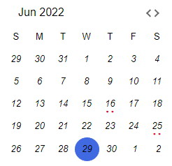

# Widgets
ICEvent Calendar widgets for 3rd party integration

## Test

## Installation
1. npm install icevent-calendar
2. insert below tag into your index.html.
<link
    async
    rel="stylesheet"
    href="https://cdn.jsdelivr.net/npm/semantic-ui@2/dist/semantic.min.css"
  />

## Configuration

